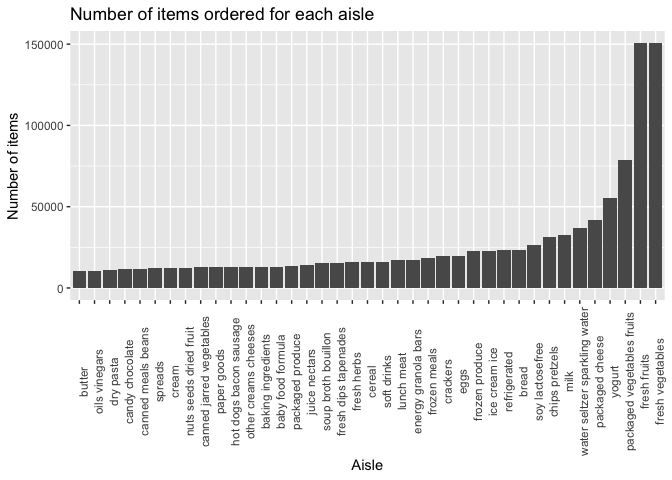
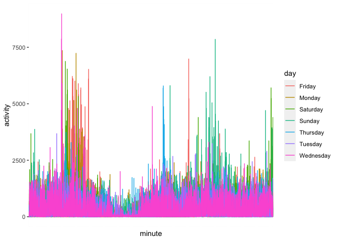
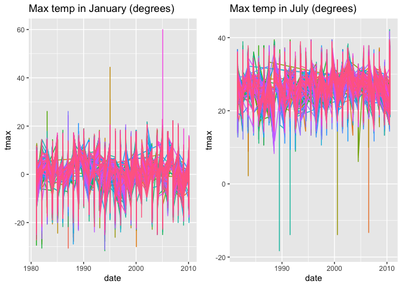
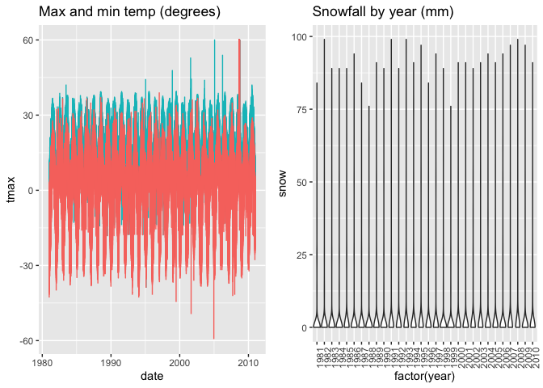

p8105\_hw3\_jp3665
================
Joana Petrescu
12/10/2020

``` r
library(tidyverse)
```

    ## ── Attaching packages ──────────────────────────────────────────────────────────────────────────────────────────────────────────────────────────────── tidyverse 1.3.0 ──

    ## ✓ ggplot2 3.3.2     ✓ purrr   0.3.4
    ## ✓ tibble  3.0.3     ✓ dplyr   1.0.2
    ## ✓ tidyr   1.1.2     ✓ stringr 1.4.0
    ## ✓ readr   1.3.1     ✓ forcats 0.5.0

    ## ── Conflicts ─────────────────────────────────────────────────────────────────────────────────────────────────────────────────────────────────── tidyverse_conflicts() ──
    ## x dplyr::filter() masks stats::filter()
    ## x dplyr::lag()    masks stats::lag()

``` r
library(p8105.datasets)
library(janitor)
```

    ## 
    ## Attaching package: 'janitor'

    ## The following objects are masked from 'package:stats':
    ## 
    ##     chisq.test, fisher.test

``` r
library(knitr)
library(gridExtra)
```

    ## 
    ## Attaching package: 'gridExtra'

    ## The following object is masked from 'package:dplyr':
    ## 
    ##     combine

## Instacart data

Load and explore data

``` r
data("instacart") %>% tidy_names()
```

    ## [1] "instacart"

``` r
dim(instacart)
```

    ## [1] 1384617      15

The “Instacart” data consist of 1384617 observations for 15 variables.
The variables are as follows:

  - `order_id`: order identifier
  - `product_id`: product identifier
  - `add_to_cart_order`: order in which each product was added to cart
  - `reordered`: 1 if this product has been ordered by this user in the
    past, 0 otherwise
  - `user_id`: customer identifier
  - `order_number`: the order sequence number for this user (1=first,
    n=nth)
  - `order_dow`: the day of the week on which the order was placed
  - `order_hour_of_day`: the hour of the day on which the order was
    placed
  - `days_since_prior_order`: days since the last order, capped at 30,
    NA if order\_number=1
  - `product_name`: name of the product
  - `aisle_id:` aisle identifier
  - `department_id`: department identifier
  - `aisle`: the name of the aisle
  - `department`: the name of the department

Here is a random observation from the data set as an example:

``` r
instacart[61,]
```

    ## # A tibble: 1 x 15
    ##   order_id product_id add_to_cart_ord… reordered user_id eval_set order_number
    ##      <int>      <int>            <int>     <int>   <int> <chr>           <int>
    ## 1       98      24964               29         1   56463 train              41
    ## # … with 8 more variables: order_dow <int>, order_hour_of_day <int>,
    ## #   days_since_prior_order <int>, product_name <chr>, aisle_id <int>,
    ## #   department_id <int>, aisle <chr>, department <chr>

This observation refers to organic garlic (produce department, fresh
vegetables aisle) that was the 29th item to be added to cart on Tuesday
at 8:00 as part of order \#98 by user \#56463. This user has ordered 40
times previously, they placed their previoous order 14 days prior to
this one, and they have ordered this item before.

``` r
instacart %>% count(aisle) %>% nrow()
```

    ## [1] 134

``` r
instacart %>% count(aisle) %>% arrange(desc(n)) %>% head() %>% knitr::kable()
```

| aisle                         |      n |
| :---------------------------- | -----: |
| fresh vegetables              | 150609 |
| fresh fruits                  | 150473 |
| packaged vegetables fruits    |  78493 |
| yogurt                        |  55240 |
| packaged cheese               |  41699 |
| water seltzer sparkling water |  36617 |

There are 134 unique aisles defined in this data set. This table
demonstrates that the most items are ordered from the fresh vegetables
and fresh fruits aisles.

Plot the number of items ordered from each isle for aisles with \>10k
items ordered.

``` r
instacart %>% 
  count(aisle) %>%
  mutate(aisle = fct_reorder(aisle, n)) %>%
  filter(n > 10000) %>% 
  ggplot(aes(x = aisle, y = n)) +
  geom_bar(stat = "identity") +
  theme(
    axis.text.x = element_text(angle = 90)
  ) +
  xlab("Aisle") +
  ylab("Number of items") +
  ggtitle("Number of items ordered for each aisle")
```

<!-- -->

Make a tablee showing the three most popular items in each of the
following: baking ingredients, dog food care, and packaged vegetables
fruits.

``` r
instacart %>%
  select(product_name, aisle) %>%
  filter(aisle %in% c("baking ingredients", "dog food care", "packaged vegetables fruits")) %>%
  group_by(aisle) %>%
  count(product_name) %>%
  top_n(3) %>%
  knitr::kable()
```

    ## Selecting by n

| aisle                      | product\_name                                 |    n |
| :------------------------- | :-------------------------------------------- | ---: |
| baking ingredients         | Cane Sugar                                    |  336 |
| baking ingredients         | Light Brown Sugar                             |  499 |
| baking ingredients         | Pure Baking Soda                              |  387 |
| dog food care              | Organix Chicken & Brown Rice Recipe           |   28 |
| dog food care              | Small Dog Biscuits                            |   26 |
| dog food care              | Snack Sticks Chicken & Rice Recipe Dog Treats |   30 |
| packaged vegetables fruits | Organic Baby Spinach                          | 9784 |
| packaged vegetables fruits | Organic Blueberries                           | 4966 |
| packaged vegetables fruits | Organic Raspberries                           | 5546 |

Make a table showing the mean hour of the day that Pink Lady Apples and
Coffee Ice Cream are ordered on each day of the week.

``` r
instacart %>%
  select(product_name, order_hour_of_day, order_dow) %>%
  filter(product_name %in% c("Pink Lady Apples", "Coffee Ice Cream")) %>%
  group_by(product_name, order_dow) %>%
  summarize(mean(order_hour_of_day)) %>%
  spread(order_dow, "mean(order_hour_of_day)") %>%
  rename(
    sunday = "0",
    monday = "1",
    tuesday = "2",
    wednesday = "3",
    thursday = "4",
    friday = "5",
    saturday = "6"
  ) %>%
  knitr::kable()
```

    ## `summarise()` regrouping output by 'product_name' (override with `.groups` argument)

| product\_name    |   sunday |   monday |  tuesday | wednesday | thursday |   friday | saturday |
| :--------------- | -------: | -------: | -------: | --------: | -------: | -------: | -------: |
| Coffee Ice Cream | 13.77419 | 14.31579 | 15.38095 |  15.31818 | 15.21739 | 12.26316 | 13.83333 |
| Pink Lady Apples | 13.44118 | 11.36000 | 11.70213 |  14.25000 | 11.55172 | 12.78431 | 11.93750 |

## Accelerometer data

This data set consists of accelerometer measurements collected over 5
weeks from a 63 year old male w/ BMI 25 who was admitted to the Advanced
Cardiac Care Center at CUMC and diagnosed with CHF. The `activity.*`
variables are activity counts for each minute of 24-hour day.

Load and tidy data. The final dataset includes

``` r
accel_data <- read.csv("./data/accel_data.csv") %>%
  tidy_names() %>%
  mutate(
    weekend = as.logical(day %in% c("Saturday", "Sunday"))
  )

accel_data$weekend
```

    ##  [1] FALSE FALSE  TRUE  TRUE FALSE FALSE FALSE FALSE FALSE  TRUE  TRUE FALSE
    ## [13] FALSE FALSE FALSE FALSE  TRUE  TRUE FALSE FALSE FALSE FALSE FALSE  TRUE
    ## [25]  TRUE FALSE FALSE FALSE FALSE FALSE  TRUE  TRUE FALSE FALSE FALSE

``` r
activity_cols <- accel_data[,grepl("activity", names(accel_data))]

accel_data %>%
  mutate(
    total_activity = activity_cols %>% rowSums(na.rm = TRUE)
) %>%
  select(week, day_id, day, weekend, total_activity) %>%
  knitr::kable()
```

| week | day\_id | day       | weekend | total\_activity |
| ---: | ------: | :-------- | :------ | --------------: |
|    1 |       1 | Friday    | FALSE   |       480542.62 |
|    1 |       2 | Monday    | FALSE   |        78828.07 |
|    1 |       3 | Saturday  | TRUE    |       376254.00 |
|    1 |       4 | Sunday    | TRUE    |       631105.00 |
|    1 |       5 | Thursday  | FALSE   |       355923.64 |
|    1 |       6 | Tuesday   | FALSE   |       307094.24 |
|    1 |       7 | Wednesday | FALSE   |       340115.01 |
|    2 |       8 | Friday    | FALSE   |       568839.00 |
|    2 |       9 | Monday    | FALSE   |       295431.00 |
|    2 |      10 | Saturday  | TRUE    |       607175.00 |
|    2 |      11 | Sunday    | TRUE    |       422018.00 |
|    2 |      12 | Thursday  | FALSE   |       474048.00 |
|    2 |      13 | Tuesday   | FALSE   |       423245.00 |
|    2 |      14 | Wednesday | FALSE   |       440962.00 |
|    3 |      15 | Friday    | FALSE   |       467420.00 |
|    3 |      16 | Monday    | FALSE   |       685910.00 |
|    3 |      17 | Saturday  | TRUE    |       382928.00 |
|    3 |      18 | Sunday    | TRUE    |       467052.00 |
|    3 |      19 | Thursday  | FALSE   |       371230.00 |
|    3 |      20 | Tuesday   | FALSE   |       381507.00 |
|    3 |      21 | Wednesday | FALSE   |       468869.00 |
|    4 |      22 | Friday    | FALSE   |       154049.00 |
|    4 |      23 | Monday    | FALSE   |       409450.00 |
|    4 |      24 | Saturday  | TRUE    |         1440.00 |
|    4 |      25 | Sunday    | TRUE    |       260617.00 |
|    4 |      26 | Thursday  | FALSE   |       340291.00 |
|    4 |      27 | Tuesday   | FALSE   |       319568.00 |
|    4 |      28 | Wednesday | FALSE   |       434460.00 |
|    5 |      29 | Friday    | FALSE   |       620860.00 |
|    5 |      30 | Monday    | FALSE   |       389080.00 |
|    5 |      31 | Saturday  | TRUE    |         1440.00 |
|    5 |      32 | Sunday    | TRUE    |       138421.00 |
|    5 |      33 | Thursday  | FALSE   |       549658.00 |
|    5 |      34 | Tuesday   | FALSE   |       367824.00 |
|    5 |      35 | Wednesday | FALSE   |       445366.00 |

It seems that the days with the lowest total activity are weekends.

``` r
accel_data %>% 
  gather("minute", "activity", 4:1443) %>%
  ggplot(aes(x = minute, y = activity)) +
           geom_line(aes(color = day)) +
  theme(axis.text.x = element_blank(),
        axis.ticks.x=element_blank())
```

<!-- -->

From this plot, it actually appears that the most activity is in the
morning and in the evening and that the subject had the most activity on
Saturdays and Sundays and the least on Wednesdays.

## Weather data

Load and tidy data, make temperature values in degrees and precipitation
values in mm. The original data has 2595176 observations of 7 variables
including station ID, date, precipitation, snowfall, max temp, min temp.
There are 3387623 NA values which suggests there is a lot of missing
data.

``` r
data("ny_noaa")

ny_noaa %>% is.na() %>% sum()
```

    ## [1] 3387623

``` r
weather_data <- ny_noaa %>%
  mutate(year = lubridate::year(date), 
         month = lubridate::month(date), 
         day = lubridate::day(date),
         tmin = as.numeric(tmin) / 10,
         tmax = as.numeric(tmax) / 10,
         prcp = as.numeric(prcp) / 10)

weather_data %>% count(snow) %>% arrange(desc(n))
```

    ## # A tibble: 282 x 2
    ##     snow       n
    ##    <int>   <int>
    ##  1     0 2008508
    ##  2    NA  381221
    ##  3    25   31022
    ##  4    13   23095
    ##  5    51   18274
    ##  6    76   10173
    ##  7     8    9962
    ##  8     5    9748
    ##  9    38    9197
    ## 10     3    8790
    ## # … with 272 more rows

The most commonly observed values for snowfall are 0 and NA because it
does not snow most days and there must be some inconsistencies with data
entry (0 vs. NA).

Plot maximum temperatures for each station in January and July across
years.

``` r
p1 <- weather_data %>% 
  filter(month == "1") %>%
  select(id, tmax, date, year, month) %>%
  drop_na() %>%
  group_by(id) %>%
  ggplot(aes(x = date, y = tmax)) +
  geom_line(aes(color = id)) +
  theme(legend.position = "none") +
  ggtitle("Max temp in January (degrees)")

p2 <-  weather_data %>% 
  filter(month == "7") %>%
  select(id, tmax, date, year, month) %>%
  drop_na() %>%
  group_by(id) %>%
  ggplot(aes(x = date, y = tmax)) +
  geom_line(aes(color = id)) +
  theme(legend.position = "none") +
  ggtitle("Max temp in July (degrees)")

grid.arrange(p1, p2, ncol=2)
```

<!-- -->
There is no obvious change over these years in maximum temperature
although it does tend to fluctuate over time. Years 2005 and 1995 seem
to be outliers of high temp in January and 1989, 1991, 2000, and 2006
seem to be outliers of low temps in July.

Make a plot showing maximum vs. minimum temperatures for the full
dataset.

``` r
p3 <- weather_data %>% 
  select(id, tmax, tmin, date, year, month) %>%
  ggplot(aes(x = date)) +
  geom_line(aes(x = date, y = tmax, color = "red")) +
  geom_line(aes(x = date, y = tmin, color = "blue")) +
  theme(legend.position = "none") +
  ggtitle("Max and min temp (degrees)")

p4 <- weather_data %>%
  select(year, snow) %>%
  filter(snow == (0:100)) %>%
  ggplot(aes(x = factor(year), y = snow)) +
  geom_violin() +
  theme(
    axis.text.x = element_text(angle = 90)
  ) +
  ggtitle("Snowfall by year (mm)")
```

    ## Warning in snow == (0:100): longer object length is not a multiple of shorter
    ## object length

``` r
grid.arrange(p3, p4, ncol=2)
```

    ## Warning: Removed 1 row(s) containing missing values (geom_path).

<!-- -->
